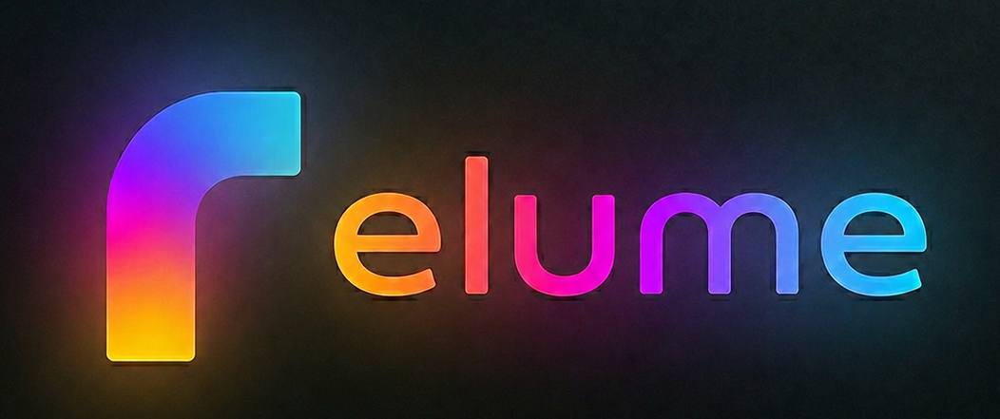

A software bridge that connects a **Philips Ambilight TV** to a **Hue Bridge Pro (BSB003)**.


> **⚠️ Disclaimer — read this first**
>
> This is an experimental hobby project, built for fun and scratching my own itch.
> It works on *my* machine, on *my* network, with *my* hardware — and that's all I
> can vouch for. I can't help debug why it doesn't work for you, and I make no
> promises that it ever will. Running an old gen-2 bridge and a new Bridge Pro
> side by side is finicky by Philips' own design, so expect rough edges. Use it at
> your own risk; no support, no warranty, no guarantees.

## What it does

The Hue **Bridge Pro (BSB003)** dropped the discovery and API surface that the TV's Ambilight+Hue
feature expects, so the TV can no longer pair with it directly. Relume sits in between: to the TV
it impersonates an old gen-2 bridge (BSB002) speaking the v1 HTTP API, and it proxies every
request to the real Bridge Pro over HTTPS/CLIP v2. See [docs/DESIGN.md](docs/DESIGN.md) for
identity, pairing, and the two control modes.

## Requirements

- **A Philips Ambilight TV** with the built-in **Ambilight+Hue** feature (the older
  integration, roughly pre-2023 models) — the TV is what discovers and drives the bridge.
  Developed and tested against a **Philips 65OLED806**, Android TV 11; other Ambilight models
  may behave differently. **Note:** 2025/2026 TVs ship the new **AmbiScape** feature instead,
  which talks to bulbs directly over Matter and bypasses the Hue Bridge entirely — those TVs
  neither need nor work with Relume.
- **A Hue Bridge Pro (BSB003)**, already set up with your lights and reachable on the LAN.
- **A Linux host** to run Relume on. Discovery uses multicast (mDNS/SSDP), so the container
  needs `network_mode: host` — **Docker Desktop on macOS/Windows won't work**, its
  host-networking mode doesn't reliably carry the multicast traffic.
- **TV, Relume host, and Bridge Pro on the same L2 network / VLAN**, with multicast allowed
  (no client/AP isolation between them).
- **TCP port 80 free on the host** — Relume emulates a gen-2 bridge, which the TV reaches on
  `:80`. The TV **hardcodes** this port and ignores any port advertised over mDNS/SSDP, so `:80`
  is effectively mandatory — don't move it. Under rootless Docker, see the
  [port-80 note](docs/TROUBLESHOOTING.md#rootless-docker-and-port-80).

## Quick start (Docker)

```bash
# 1. Start the service. On first run relume auto-pairs with the Bridge Pro in the
#    background — just briefly TAP the link button on the Pro (do not hold it).
docker compose up -d

# 2. On the TV, start the Ambilight+Hue bridge search and select relume.
#    relume auto-accepts the TV's pairing — no button to press on relume's side.

# Optional: pair up front and verify before serving. Add -bridge-ip <ip> if cloud
# discovery finds nothing.
docker compose run --rm relume setup
```

The image is pulled from `ghcr.io/trick77/relume` (built by the release workflow).
To build locally instead: `docker build -f Containerfile -t relume:dev .`

### Data & secrets

State (bridge identity, TV tokens, **Bridge Pro app key + client key**) lives in
`./data/relume.json`. This file holds secrets — do not share or commit it (it is gitignored).

## Usage

### Commands

| Command | Purpose |
|---------|---------|
| `serve` | Run the service (discovery + bridge emulation). Default. |
| `setup` | Pair with the Bridge Pro (fetch app key, pin certificate). |
| `discover` | Find the Bridge Pro via the Philips cloud. |
| `avahi-service` | Emit an Avahi service file (see the avahi caveat in the troubleshooting guide). |
| `version` | Print the version. |

### Flags (`serve`)

- **`-mode`** &nbsp;·&nbsp; default `rest` — Control mode: `rest` (per-light REST-follow) or `entertainment` (low-latency DTLS stream to the Pro). See [docs/DESIGN.md](docs/DESIGN.md#control-modes).
- **`-http-port`** &nbsp;·&nbsp; default `80` — HTTP port the TV connects to. The TV hardcodes `:80` and ignores any other advertised port, so changing this will almost certainly break discovery/pairing — leave it at `80`.
- **`-advertise-ip`** &nbsp;·&nbsp; default auto — IP advertised via mDNS/SSDP; set it on a multi-homed host.
- **`-bridge-ip`** — Bridge Pro IP (skips cloud discovery).
- **`-idle-off-timeout`** &nbsp;·&nbsp; default `30s` — When the TV stops driving the lights for this long, flash them and turn them off (the TV sends no off signal, it just goes silent). `0` disables.
- **`-entertainment-dtls-timeout`** &nbsp;·&nbsp; default `5s` — Entertainment mode: how long to wait, after confirming the TV's stream activation, for the TV to open its DTLS stream before reverting to REST-follow. Raise it if a TV opens its stream slower.
- **`-skip-tls-verify`** &nbsp;·&nbsp; default off — Skip Bridge Pro certificate pinning (fallback).
- **`-debug`** &nbsp;·&nbsp; default off — SSDP/HTTP diagnostics + mDNS observer.

Discovery-debugging flags (`-identity-profile`, `-ssdp-*`, `-description-profile`,
`-discovery-burst-*`) are documented in [docs/TROUBLESHOOTING.md](docs/TROUBLESHOOTING.md).

## Troubleshooting

The most common reason the TV never lists Relume: **a powered-on Bridge Pro (or any other Hue
bridge) on the same LAN wins discovery and hides it.** Power the other bridge off — or block it
from the cloud — before scanning, then run the TV's Ambilight+Hue search again.

Everything else — entertainment reconnect, the avahi/mDNS port clash, rootless port 80, and the
deeper discovery/coexistence problem with the experimental identity flags — is in the
**[troubleshooting guide](docs/TROUBLESHOOTING.md)**.

## Development

```bash
go build -o relume ./cmd/relume
go test ./...
```

## Documentation

- **[docs/DESIGN.md](docs/DESIGN.md)** — how Relume works: identity, pairing, control modes.
- **[docs/TROUBLESHOOTING.md](docs/TROUBLESHOOTING.md)** — discovery, common issues, debug flags.
- **[PLAN.md](PLAN.md)** — project status and next steps.
