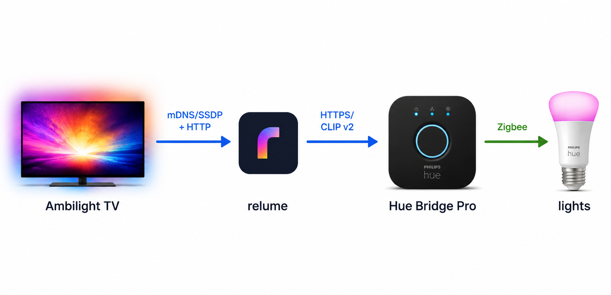

# How relumeTV works

relumeTV sits between a **Philips Ambilight TV** and a **Hue Bridge Pro (BSB003)**. To the
TV it pretends to be an old gen-2 Hue bridge (BSB002); to the Bridge Pro it acts as a
normal Hue app. Every TV request is translated and proxied to the real bridge.

## Why a bridge is needed

The Bridge Pro breaks the Ambilight+Hue integration in three ways that relumeTV papers over:

1. **No SSDP/UPnP** — the Pro is only discoverable via mDNS and the Philips cloud, but the
   TV firmware expects to find a bridge via the local discovery paths a gen-2 bridge used.
2. **HTTPS:443 only** — the Pro no longer serves plain HTTP:80 (it returns 301), while the
   TV's Hue client is wired for HTTP.
3. **CLIP v2 only** — the v1 discovery/pairing/control endpoints the TV speaks no longer
   resolve on the Pro.

relumeTV presents the old BSB002 identity and the v1 HTTP API the TV expects, and translates
everything to CLIP v2 against the Pro.

## Key design decisions

| Topic | Decision |
|-------|----------|
| Base | Standalone Go proxy (diyHue is reference only, not a fork) |
| Deployment | Docker with `network_mode: host` — multicast discovery needs the TV's L2 |
| Lights | Proxied live from the Bridge Pro (no local light database) |
| Control path | Two modes: Entertainment/DTLS (default) and REST-follow (automatic fallback) |
| Bridge Pro setup | One-time pairing; the TLS certificate is pinned (`-skip-tls-verify` to override) |

## Components

**Frontend (TV-facing, emulates BSB002):**
- `internal/ssdp` — multicast responder (M-SEARCH) + periodic NOTIFY ssdp:alive.
- `internal/mdns` — active `_hue._tcp` announcer (`Philips Hue - XXXXXX`, TXT bridgeid + modelid=BSB002).
- `internal/upnp` — `/description.xml` with the BSB002 identity.
- `internal/clipv1` — HTTP server: pairing (`POST /api`), `config`, lights/groups, REST control,
  and the entertainment stream activation handshake.

**Backend (Bridge Pro-facing, acts as a Hue app):**
- `internal/bridgepro` — CLIP v2 client (HTTPS + certificate pinning), pairing, resource reads,
  REST control, and the entertainment-configuration calls.

**Core:**
- `internal/config` — persistent state: identity, TV tokens, Pro pairing, light mapping.
- `internal/translate` — v1↔v2 translation + v1-id↔UUID mapping.
- `internal/entertainment` — DTLS-PSK receiver (from the TV) + the streamer (to the Pro).
- `internal/huestream` — the HueStream wire format (parse + encode).
- `internal/bridge` — wiring frontend↔backend, the coalescing light provider, restart/idle turn-off.
- `cmd/relumetv` — subcommands: `serve` (default), `avahi-service`, `version`.

## Pairing

- **TV → relumeTV:** auto-accepted, no link button or UI. relumeTV only pairs the TV (by source IP
  matching `-tv-ip`, or the Philips-TV Android/Dalvik User-Agent); other LAN devices get error
  101. `POST /api` is idempotent per devicetype (the TV polls it quickly).
- **relumeTV → Bridge Pro:** automatic in `serve`, driven by the guided setup wizard in the web UI.
  If no Pro is paired, a background task discovers it via **local mDNS** (`_hue._tcp.local.`, picking
  the first real Hue Bridge Pro by its advertised modelid BSB003; no Philips cloud), pins its
  certificate, and polls until the user taps the Pro's physical link button (the one non-automatable
  step), then hot-loads the lights. Once paired, relumeTV health-checks the Pro and, on failure, re-discovers its
  IP via the cloud / re-pins the cert without re-pairing (the app key and client key persist).

## Control modes

relumeTV drives the lights in one of two modes (`-mode`). Entertainment is the default; REST is the
automatic fallback (the watchdog reverts to it when a TV confirms activation but never opens its
DTLS stream, and the Pro-side path falls back to it on a DTLS/config failure).

### REST-follow (`-mode rest`, fallback)

relumeTV gives the TV the generic stream-activation acknowledgement, so the TV stays on its
fallback path: per-light v1 `PUT` writes. relumeTV translates each write to CLIP v2 and forwards
it to the Pro through a coalescing async provider (it acknowledges the TV immediately and keeps
only the latest state per light, so the TV's control loop never blocks on the Pro round-trip).

This is simple and proven, but it cannot sustain the full Ambilight frame rate: per-light CLIP
v2 writes are rate-limited and the Pro's command queue overflows (`503 command queue is full`)
under a real ~25 fps stream.

### Entertainment / DTLS (`-mode entertainment`, default)

This is the low-latency path a real Hue entertainment app uses, and it removes the REST
bottleneck:

1. **Receive.** relumeTV confirms the TV's stream activation for real, so the TV opens a DTLS
   stream to relumeTV on udp :2100 (PSK = the client key relumeTV minted for the TV at pairing).
   `internal/huestream` decodes each HueStream frame.
2. **Re-stream to the Pro.** relumeTV opens its **own** entertainment stream to the Bridge Pro: it
   creates (or reuses) a `relumetv` `entertainment_configuration` covering the colour-capable
   lights, starts it, and dials a DTLS-PSK client to the Pro (PSK = the Pro's app key / client
   key). Each decoded TV frame is re-encoded as a HueStream v2 frame and streamed at ~50 Hz.
   The TV's v1 light id is mapped to the Pro's channel id using the bridge-assigned channels read
   back from the configuration (ground truth, not an assumed order).
3. **Pro-side fallback (relumeTV→Pro).** If the configuration, the stream start, or the DTLS
   handshake *to the Pro* fails, relumeTV automatically falls back to the REST forward so the lights
   still follow (capped). DTLS and REST are mutually exclusive at runtime — never both.
4. **TV-side fallback (TV→relumeTV).** Confirming activation commits the TV to DTLS — it stops
   sending per-light REST PUTs. So if the TV confirms but never opens its DTLS stream, there would
   be no light control at all. A watchdog guards this: when relumeTV confirms an activation it waits
   5s for the TV's DTLS stream; if none arrives it **stickily** reverts to REST-follow (stops
   confirming activations and reports the group stream inactive), so the TV resumes PUTs. This is
   a safety net for TVs/firmwares that don't open the stream. It does **not** cover a relumeTV
   restart mid-session (the TV then sends nothing to fall back to). The fallback is logged
   unambiguously:
   `entertainment: TV did NOT open the DTLS stream in time — FALLING BACK to REST-follow`.

A relumeTV restart in the middle of a session orphans the TV's stream; the TV then only polls
light state and the lights go idle. Toggling Ambilight (not Ambilight+Hue) off and on on the TV
re-runs the activation handshake.

## Web UI

relumeTV serves a web UI — a guided setup assistant plus a live status dashboard.
It is **on by default** on the predefined port `33100`; `-ui-port` overrides that with a custom
port (must differ from the TV-facing `-http-port`), and `-headless` disables it entirely. It has
no authentication, so under `network_mode: host` it is reachable by anyone on the LAN — run
`-headless` on untrusted networks. Design notes:

- **Embedded, no build step.** Static HTML/CSS/JS compiled into the binary via `go:embed`
  (`internal/webui/assets`). No npm/Node/framework.
- **Read-mostly.** The UI reads live state through a `webui.StateSource` adapter
  (`cmd/relumetv/uisource.go`) — the TV- and Pro-facing control paths are never modified. The only
  action is a test flash.
- **State delivery.** `GET /api/state` returns a JSON snapshot; `GET /api/events` is a
  Server-Sent Events stream pushing snapshot updates plus a live log tail. The log tail is
  captured non-invasively by teeing the existing `slog` logger into the hub
  (`webui.NewLogHandler`), so it mirrors exactly what goes to stderr.
- **No secrets.** App keys, client keys and the cert fingerprint never appear in any snapshot
  (asserted by a test).
- **No authentication** — with `network_mode: host` the port is reachable on the LAN, so the UI
  assumes a trusted network. A bind/serve failure is logged but never takes down the headless service.
- **CSRF guard on the action.** The flash POST rejects requests whose `Origin` does not match the
  server (browsers always send it cross-origin), closing the browser/DNS-rebinding path. A missing
  `Origin` (curl / direct LAN access) is allowed — that path is already within the trusted-LAN model.

## Identity invariants

The TV is picky about the emulated bridge identity:

- `modelid` is `BSB002` in `/config`, the mDNS TXT record, and SSDP. (The confirmed-working
  ha-hue-entertainment emulator also sends `BSB002`.)
- `description.xml` is served as `Content-Type: text/xml`.
- `bridgeid` = `upper(serial[:6] + "FFFE" + serial[6:])`; the SSDP UUID, the `description.xml`
  UDN, the SSDP hue-bridgeid header, the mDNS TXT, and `/config` all agree on it.

## Bridge Pro facts

- HTTPS:443 only; HTTP:80 returns 301. CLIP v2 only.
- Self-signed Signify certificate (leaf OU=BSB003). relumeTV pins the leaf SHA-256 and does not
  trust the CA chain.
- `PUT` returns `207` multi-status with per-attribute `errors[]` even when the HTTP status is OK —
  the error array must be inspected, not just the status code.
- CT-only / white / dimmable / on-off bulbs reject `color.xy` (`207`). relumeTV therefore offers
  **only colour-capable lights** to the TV; v1 light ids are assigned in sorted-UUID order over
  the kept lights so they stay stable.
